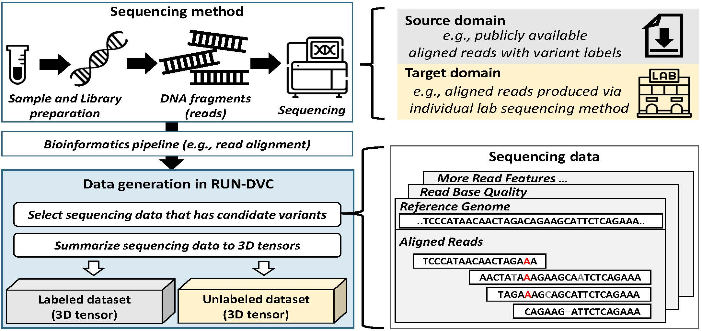
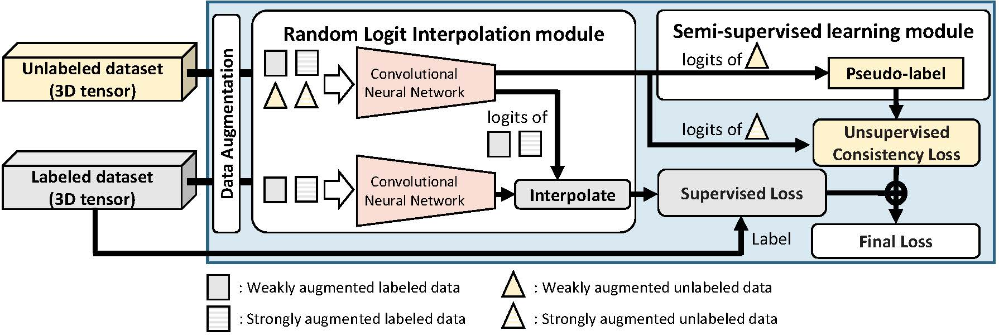

# RUN-DVC: Generalizing DL-based variant callers (DVC) with domain adaptation and semi-supervised learning
Contact: Youngmok Jung, Dongsu Han, Young Seok Ju

Email: tom418@kaist.ac.kr, dhan.ee@kaist.ac.kr, ysju@kaist.ac.kr

---
- We introduce a new perspective, framing the enhancement of the generalizability and robustness of DVC against a target sequencing method as domain adaptation and semi-supervised learning problems, leveraging readily accessible unlabeled datasets from the target sequencing method.
- We view each sequencing method with different error profile as a unique domain. Factors such as sample source, sample preparation protocols, library construction techniques, sequencing configurations, and variations across machines from different companies contribute to distinct error profiles.
- RUN-DVC leverages the consistency training and random logit interpolation techniques, allowing it to learn sequencing error profiles from unlabeled data of the target sequencing method using the knowledge obtained in labeled data. 
- These training techniques are complementary to the supervised training approach, positioning RUN-DVC as an alternative training solution
for existing DVCs.


<!-- ## What RUN-DVC provides:
- presents an alternative to the supervised training methods in DVC.
- improves robustness of DVC against a specific sequencing method using its unlabeled datasets.
- achieves higher variant calling accuracy in a target sequencing method using fewer labels (nearly half) when partially labeled datasets are available.
- works on multiple sequencing platforms including Illumina, BGI, PacBio, and ONT. -->






---

## Table of Contents
  * [Prerequisites](#prerequisites)
  * [Environment setting](#environment-setting)
  * [Dataset generation](#dataset-generation)
  * [Training Pileup model](#training-pileup-model)
  * [Training CNN model with RUN-DVC](#training-cnn-model-with-run-dvc)
  * [Calling variants with trained models](#calling-variants-with-trained-models)
  * [Evaluation with hap.py](#evaluation-with-happy)
  * [Notes](#notes)
  * [Acknowledgement](#acknowledgement)
  * [Citation](#citation)

## Workflow for reproducing results of RUN-DVC
1. Generate labeled datasets from source domain.
2. Train pileup RNN model using source domain datasets. 
3. Generate unlabeled datasets from target sequencing method (target domain).
4. Train CNN model using both labeled and unlabeled datasets.
5. Variant calling with the trained model in target sequencing method.
---
## Server requirements 
- More than 100GB of RAM (minimum 64GB)
  -  this is due to multi-process data loader, revise the number of data loader thread in `train_rundvc.py` file.
- More than 10GB of GPU memory size
- More than 32 vCPUs

## Prerequisites
- Sequencing datasets (BAM and BAI files) to use as source domain (e.g., NovaSeq PCR-free dataset) [link](https://console.cloud.google.com/storage/browser/brain-genomics-public/research/sequencing/grch38/bam/novaseq/wgs_pcr_free?pageState=(%22StorageObjectListTable%22:(%22f%22:%22%255B%255D%22))&prefix=&forceOnObjectsSortingFiltering=false)
- Sequencing datasets (BAM and BAI files) to use as target domain (e.g., NovaSeq PCR-plus dataset) [link](https://console.cloud.google.com/storage/browser/brain-genomics-public/research/sequencing/grch38/bam/novaseq/wgs_pcr_plus?pageState=(%22StorageObjectListTable%22:(%22f%22:%22%255B%255D%22))&prefix=&forceOnObjectsSortingFiltering=false)
- Truth VCF and BED files for both source and target domain (for evaluation) [link](https://ftp-trace.ncbi.nlm.nih.gov/giab/ftp/release/)
- Reference genome
- [optional] Genome stratifications files [link](https://ftp-trace.ncbi.nlm.nih.gov/giab/ftp/release/genome-stratifications/)
---
## Environment setting 
- Please install NVIDIA Docker [Install Page Link](https://github.com/nvidia/nvidia-docker/wiki/Installation-(version-2.0)#installing-version-20) 
- You can use the docker-hub image or the Dockerfile_torch
```sh
# Please check your NVIDIA-driver version and supported Pytorch version
# For Pytorch 1.10
docker pull tom418/rundvc:1.10
# For Pytorch 2.x
docker pull tom418/rundvc:2.0
```
- or you can build your image locally
```sh
# Below builds RUNDVC docker image with Pytorch 1.10, change to 2.0 to use Pytorch 2.0
mkdir tmp_docker/
cp Dockerfile_torch_1.10 tmp_docker/Dockerfile
cd tmp_docker
docker build . --tag rundvc:1.10
```
- Run container with below command
```sh
sudo docker run -it --runtime=nvidia -e NVIDIA_VISIBLE_DEVICES=0,1 -v /<Your Folder>/:/data --ipc=host --name rundvc <Image_Name>
```
- Before proceeding, activate conda environment inside docker container
```sh
conda activate rundvc
```
---
## Dataset generation
- All commands should be executed inside the docker container.
### First, we need to compile realigner for short reads
```sh
cd preprocess/realign
g++ -std=c++14 -O1 -shared -fPIC -o realigner ssw_cpp.cpp ssw.c realigner.cpp
g++ -std=c++11 -shared -fPIC -o debruijn_graph -O3 debruijn_graph.cpp -I ${CONDA_PREFIX}/include -L ${CONDA_PREFIX}/lib
cd ../..
```
### Generating datasets
- We provide a template bash script for generating datasets in [data_scripts](data_scripts/) folder.
- Pair of two files (env_XXX.sh and make_dataset_XXX.sh) is required.

### Generating labeled datasets
- Please see `env.sh` for configuration and `make_dataset.sh` for labeled datasets generation.
- To generate pileup dataset see `make_dataset_pileup.sh`, it uses the same `env.sh` file for configuration.
- Note that, ONT datasets requires pileup model to generate full alignment datasets.

### Generating unlabeled datasets without Truth VCF files
- *Pileup model trained in the source domain is required* for generating unlabeled datasets, please download or generate pileup model before proceeding. 
- Pileup model is used to score candidate variants and is used for filtering when there are excessive number (over 20 million per human genome) of candidate variants. However, most of the short read datasets have candidate variants less than 20 million per single genome.
- Please see `env_ul.sh` and `make_ul_dataset.sh` for unlabeled datasets generation without Truth VCF files.
- `make_ul_dataset.sh` *assumes INDEL realignment is alreay performed during labeled dataset generation*. Uncomment the realignment code to use it.

---
## Training Pileup model
- RUN-DVC use source domain datasets to train pileup model.
- Pileup model is used for phasing long reads or filtering candidate variants at unlabeled dataset generation.
```sh
# Below is an example of training pileup model
MODEL_FOLDER_PATH="data/train_result_RUNDVC"
BINS_FOLDER_PATH="/data/data_bins_fix/data_bin_P_novaseq_pcr"
python /root/RUN-DVC/RUNDVC/Train_torch.py \
    --bin_fn ${BINS_FOLDER_PATH} \
    --ochk_prefix ${MODEL_FOLDER_PATH}/pileup \
    --add_indel_length True \
    --random_validation \
    --pileup \
    --platform ilmn
```

## Training CNN model with RUN-DVC
- Training RUNDVC.
```sh
# Below is an example of training RUNDVC script for Short reads
MODEL_FOLDER_PATH="data/train_result_RUNDVC"
mkdir -p ${MODEL_FOLDER_PATH}

BINS_FOLDER_PATH="/data/data_bins_fix/data_bin_F_novaseq_pcr"
UL_BINS_FOLDER_PATH="/data/data_bins_fix/data_NOSELECT_novaplus"
PLATFORM="ilmn"

python /root/RUN-DVC/RUNDVC/train_rundvc.py \
    --random_validation --maxEpoch 50 \
    --bin_fn ${BINS_FOLDER_PATH} \
    --bin_fn_ul ${UL_BINS_FOLDER_PATH} \
    --ochk_prefix ${MODEL_FOLDER_PATH} \
    --platform ${PLATFORM} \
    --USE_SWA True --swa_start_epoch 19
```

- Training BaselineBN or Full-label model and ablation study
```sh
# You can use below arguments to disable SSL or RLI module.
# If you disable those, it works in the supervised training method, BaselineBN
--USE_RLI False --USE_RLI False

# Below is an example for training in supervised manner, while providing validation error for both source and target domain.
MODEL_FOLDER_PATH="data/train_result_RUNDVC"
mkdir -p ${MODEL_FOLDER_PATH}

BINS_FOLDER_PATH="/data/data_bins_fix/data_bin_F_novaseq_pcr"
UL_BINS_FOLDER_PATH="/data/data_bins_fix/data_NOSELECT_novaplus"
PLATFORM="ilmn"

python /root/RUN-DVC/RUNDVC/train_rundvc.py \
    --random_validation --maxEpoch 50 \
    --bin_fn ${BINS_FOLDER_PATH} \
    --bin_fn_ul ${UL_BINS_FOLDER_PATH} \
    --ochk_prefix ${MODEL_FOLDER_PATH} \
    --platform ${PLATFORM} \
    --USE_SWA True --USE_RLI False --USE_RLI False --swa_start_epoch 19

```

- Training RUNDVC in SSDA setting
```sh
# Additional parameters are used for SSDA setting
# --bin_fn_tl is for the directory of target labeled datasets
# --tl_size is the amount of labeled datasets to use
# --seed for setting random seed

# Below is an example for training in SSDA setting.
MODEL_FOLDER_PATH="data/train_result_RUNDVC"
mkdir -p ${MODEL_FOLDER_PATH}

BINS_FOLDER_PATH="/data/data_bins_fix/data_bin_F_novaseq_pcr"
TL_BINS_FOLDER_PATH="/data/data_bins_fix/data_NOSELECT_novaplus"
UL_BINS_FOLDER_PATH="/data/data_bins_fix/data_NOSELECT_novaplus"
PLATFORM="ilmn"

python /root/RUN-DVC/RUNDVC/train_rundvc.py \
    --random_validation --maxEpoch 50 \
    --bin_fn ${BINS_FOLDER_PATH} \
    --bin_fn_ul ${UL_BINS_FOLDER_PATH} \
    --bin_fn_tl ${TL_BINS_FOLDER_PATH} \
    --ochk_prefix ${MODEL_FOLDER_PATH} \
    --platform ${PLATFORM} \
    --USE_SWA True  --swa_start_epoch 19 --tl_size 100000 --seed 1

```
---
## Calling variants with trained models
### Trained CNN models should be merged into single model before being used
- Use below command to merge encoder and classifier.
```sh
# Please revise the arguments
python /root/RUN-DVC/RUNDVC/merge_model.py --model <SAVE_MODEL.best> --output <Output Directory> --platform <ilmn,hifi,ont>
``` 

### We provide scripts for calling variants with the trained models of RUN-DVC framework. 
- See `rundvc_callvariants.sh` or example below.
```sh
# Please revise the arguments before using.
# For short reads
mkdir -p /data/output/calls/
BAM_FILE="/data/HG003.novaseq.pcr-free.30x.dedup.grch38.bam"
DATA_NAME="baseline_novaplus2novafree"
MODEL="/data/rundmc/baseline_novaplus.pt"
./run_rundmc.sh \
  --rundvc_call_mut \
  --bam_fn=${BAM_FILE} \
  --bed_fn=/data/data_HG00X/HG003_GRCh38_1_22_v4.2.1_benchmark.bed  \
  --ref_fn=/data/human_ref/hg38/Homo_sapiens_assembly38.fasta \
  --threads=94 \
  --chunk_num=50 \
  --platform="ilmn" \
  --fa_model=${MODEL} \
  --no_phasing_for_fa \
  --output=/data/output/calls/rundvc_${DATA_NAME}

# for Pacbio HIFI with pileup model
P_MODEL="/data/rundmc/p_model.pt"
FA_MODEL="/data/rundmc/fa_model.pt"
./run_rundmc.sh \
  --rundvc_call_mut \
  --bam_fn=${BAM_FILE} \
  --bed_fn=/data/data_HG00X/HG003_GRCh38_1_22_v4.2.1_benchmark.bed  \
  --ref_fn=/data/human_ref/hg38/Homo_sapiens_assembly38.fasta \
  --threads=94 \
  --chunk_num=50 \
  --platform="hifi" \
  --pileup_model=${P_MODEL} \
  --fa_model=${FA_MODEL} \
  --no_phasing_for_fa \
  --output=/data/output/calls/rundvc_${DATA_NAME}


# for ONT with pileup model
P_MODEL="/data/rundmc/p_model.pt"
FA_MODEL="/data/rundmc/fa_model.pt"
./run_rundmc.sh \
  --rundvc_call_mut \
  --bam_fn=${BAM_FILE} \
  --bed_fn=/data/data_HG00X/HG003_GRCh38_1_22_v4.2.1_benchmark.bed  \
  --ref_fn=/data/human_ref/hg38/Homo_sapiens_assembly38.fasta \
  --threads=94 \
  --chunk_num=50 \
  --platform="ont" \
  --pileup_model=${P_MODEL} \
  --fa_model=${FA_MODEL} \
  --no_phasing_for_fa \
  --output=/data/output/calls/rundvc_${DATA_NAME}
```

---
## Evaluation with hap.py
- You should download stratifications from [here](https://ftp-trace.ncbi.nlm.nih.gov/giab/ftp/release/genome-stratifications/).
- See [here](https://github.com/genome-in-a-bottle/genome-stratifications/) for descriptions of stratifications
```sh
# Below is an example of running hap.py with stratifications
mkdir -p /data/output/full_label
docker run -it -v /ssd2:/data pkrusche/hap.py /opt/hap.py/bin/hap.py \
        /data/data_HG00X/HG003_GRCh38_1_22_v4.2.1_benchmark.vcf.gz \
        /data/rundmc/Fulllabel_hiseqX/merge_output.vcf.gz \
         -o /data/output/full_label/full_label_hg003_hiseqX \
         -r /data/human_ref/hg38/Homo_sapiens_assembly38.fasta \
         -f /data/data_HG00X/HG003_GRCh38_1_22_v4.2.1_benchmark.bed \
          --threads 64 --engine=vcfeval  --roc QUAL \
          --stratification /data/genome-stratifications/GRCh38/v3.1-GRCh38-all-stratifications.tsv

```

---
## Notes

* RUNDVC uses a significant amount of CPU during training owing to data augmentations.

## Acknowledgement
- RUN-DVC heaviliy makes use of open source project [Clair3](https://github.com/HKU-BAL/Clair3).
```
This project includes codes from Clair3, which is licensed under BSD 3-Clause License. 
The original source code for Clair3 can be found at https://github.com/HKU-BAL/Clair3.
The modifications to Clair3 in this project are made by Youngmok Jung and are licensed under the BSD 3-Clause license. 
```
## Citation

If you found RUN-DVC interesting and want to cite! Please cite the following [paper]()
<!-- **Youngmok Jung, Dongsu Han, BWA-MEME: BWA-MEM emulated with a machine learning approach, Bioinformatics, Volume 38, Issue 9, 1 May 2022, Pages 2404–2413, https://doi.org/10.1093/bioinformatics/btac137** -->


```
@article{
}

```

## Future works
- Training DVC on simulated reads and transfering knowledge to real-world data
- Extending RUN-DVC to somatic mutation calling
- Active learning for improving label-efficiency
- Improving performance of RUN-DVC with hyper-parameter adjustment and data-augmentations
- Evaluating in RUN-DVC on different species
